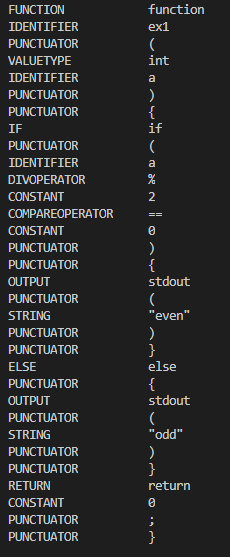
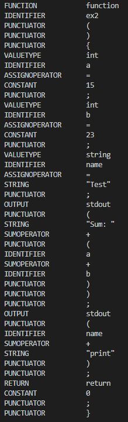
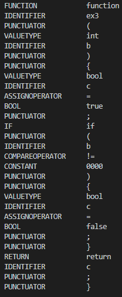
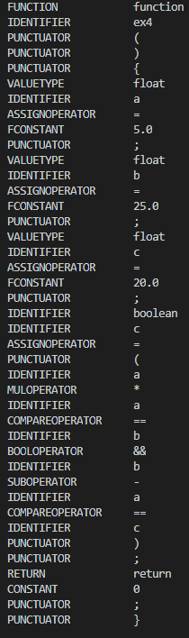
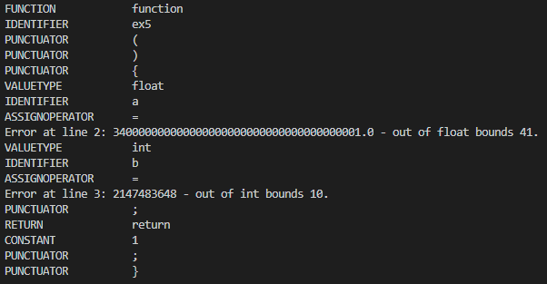
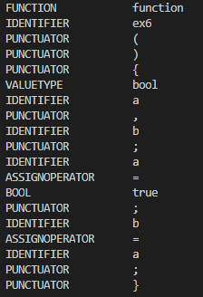
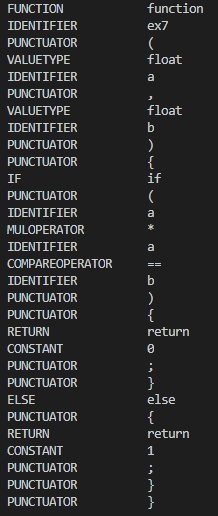
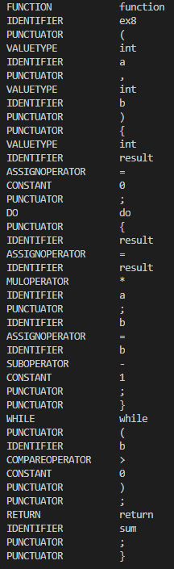
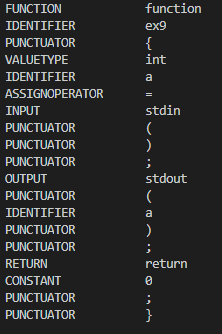
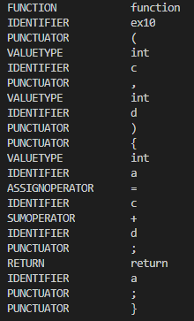

# Лабораторная работа 1 - Разработка блока лексического анализа компилятора

### Цель

Изучение методов лексического анализа с их программной
реализацией.

### Задачи

* Изучение теоретического материала по организации лексического
анализа языков программирования.
* Составление формального описания программы лексического анализа.
* Программная реализация по формальному описанию.

### Спецификация flex

Код лексического анализатора представлен в `./lexer.l`.

### Тестовые примеры работы программы

Тестовые примеры представленны `./examples`.

#### Пример 1
```
function ex1(int a) {
    if (a % 2 == 0) {
        stdout("even")
    } else {
        stdout("odd")
    }

    return 0;
}
```


#### Пример 2
```
// Функция
function ex2() {
    int a = 15;
    int b = 23;

    string name = "Test";

    stdout("Sum: " + (a + b));
    stdout(name + "print");

    return 0;
}
```


#### Пример 3
```
function ex3(int b) {
    bool c = true;

    if (b != 0000) {
        bool c = false;
    }

    return c;
}
```


#### Пример 4
```
function ex4() {
    float a = 5.0;

    float b = 25.0;

    float c = 20.0;

    boolean c = (a * a == b && b - a == c);

    return 0;
}
```


#### Пример 5
```
function ex5() {
    float a = 340000000000000000000000000000000000001.0
    int b = 2147483648;
    
    return 1;
}
```


#### Пример 6
```
function ex6() {
    bool a, b;

    a = true;
    b = a;
}
```


#### Пример 7
```
function ex7(float a, float b) {
    if (a * a == b) {
        return 0;
    } else {
        return 1;
    }
}
```


#### Пример 8
```
function ex8(int a, int b) {
    int result = 0;

    do {
        result = result * a;
        b = b - 1;
    } while (b > 0);

    return sum;
}
```


#### Пример 9
```
function ex9 {
    int a = stdin();
    
    stdout(a);

    return 0;
}
```


#### Пример 10
```
function ex10(int c, int d) {
    int a = c + d;
    
    return a;
}
```
