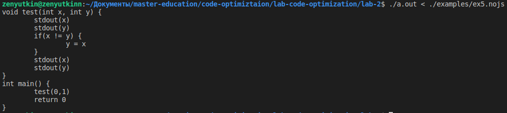

# Лабораторная работа 2 - Разработка блока синтаксического и контекстного анализа компилятора

## Общие сведения

### Инструкция по сборке

Исходный код представлен в `./src`.

Тестовые примеры работы программы находятся <a href="#Тестовые-примеры-работы-программы">здесь</a>

Документация к проекту находится [здесь](https://zenutkinn.github.io/lab-code-optimization/lab-2/doxygen/html/index.html)

Для сборки проекта необходимо выполнить следующую команду

```
make
```

Для запуска необходимо передать файл с вашим кодом на языке NoJS исполняемому файлу a.out

```
./a.out < [pathToFile]
```

## Описание работы

### Цель

Цель: изучение основных методов организации таблиц идентификаторов в
компиляторах языков программирования и методов синтаксического и
контекстного анализа с их программной реализацией.

### Задачи

* Изучение теоретического материала об основных методах организации
таблиц имен.
* Изучение теоретического материала по организации синтаксического и
контекстного анализа языков программирования.
* Составление формального описания процессов синтаксического и
контекстного анализа.
* Программная реализация по формальному описанию.


### Журнал проекта

| Дата  | Исполнитель  | Задание |
|:-------------: |:---------------:| :-------------:|
| 10.02.2020 – 16.05.2020     | Зенюткин Н.В. |     Разработка “Белой книги” |
| 25.05.2020 – 31.05.2020      | Зенюткин Н.В.        |  Разработка лексического анализатора   |
| 01.06.2020 – 07.06.2020  | Зенюткин Н.В.        |       Реализация синтаксического анализатора |


### Классификация отслеживаемых транслятором ошибок
Все отслеживаемые программой ошибки делятся на 3 группы:
* Лексические: выход чисел за границы (“Error at line %d: %s – out of int
bounds %d.\n”), употребление символа, не определенного алфавитом (“LEXICAL
ERROR”), незакрытая кавычка при инициализации строки (“IS NOT A
STRING”);
* Синтаксические: неправильное использование конструкций (“syntax
error”);
* Семантические: несоответствие типов в выражениях, неправильное
употребление типов (“Wrong type of argument!”), несоответствие размеров
массивов при их инициализации (“Incorrect access to array element!”),
переменная/функция не объявлена (“Label isn’t created”, “Identifier does not
exist!”).

### Лексическая структура языка

#### Ключевые слова

Ключевыми и зарезервированными словами в языке NoJS являются:
* if
* else
* do
* while
* return
* string
* int
* float
* bool
* function

#### Символы пунктуации 

К символам пунктуации в языке NoJS относятся:

* !
* &
* |
* (
* )
* {
* }
* +
* -
* \*
* <
* \> 
* =
* /
* ;
* ,
* .

Символы	(	)	{	} 	должны использоваться попарно.

#### Идентификаторы

В языке NoJS идентификаторы используются для обозначения следующих элементов:
* имени переменной;
* имени функции.

Идентификатор может содержать строчные и прописные символы латинского алфавита, десятичные цифры или символ `_`. Идентификатор не должен начинаться с десятичной цифры.
Идентификаторы не могут совпадать с зарезервированными словами.

#### Разделители

В языке NoJS символами разделителями являются:
* пробельный символ
* символ табуляции
* точка с запятой
* запятая.

#### Литералы 

Язык NoJS поддерживает следующие виды литералов:
* целочисленный литерал;
* литерал с плавающей точкой;
* строковый литерал;
* логический литерал.

#### Целочисленный литерал

Целочисленные литералы используются для отображения в программе целых чисел.
Целых чисел изображаются последовательностью десятичных цифр.
Целочисленные литералы всегда имеют положительные значения. Для использования отрицательных целых чисел используется символ «-» помещённый перед выражением.
Целочисленные литералы рассматриваются как величины со знаками и имеют тип int.

#### Литерал с плавающей точкой

Литерал с плавающей точкой используются для отображения в программе вещественных чисел.
Вещественные числа определяются целой и дробной частью состоящих из десятичных цифр, разделенных символом «.». Для использования отрицательных вещественных чисел используется символ «-» помещённый перед выражением.
Все литералы с плавающей точкой имеют тип float.

#### Строковый литерал

Строковый литерал представляет последовательность символов, которые вместе образуют строку с завершающим нулевым символом. Символы должны быть заключены в двойные кавычки.
Строковые литералы имеют тип string.

#### Логический литерал

Логический литерал может иметь два значения – true и false. Логические значения true и false не преобразуются ни в какое числовое представление.
Логический литерал имеет тип bool.

#### Комментарии

Комментарием в языке NoJS является символ «//», за которыми следует любая последовательность символов. Символ перевода строки завершает комментарий.
Примеры кода представлены в Приложении А.

### Выражения и операторы

Операторы, используемые в языке NoJS представлены в следующей таблице 

|Приоритет|Тип оператора|Ассоциативность|Оператор|
|:---:|:---:|:---:|:---:|
|10|Группировка|не определенно|(…)|
|9|Вызов функции|слева направо|… ( … )|
|8|Логическое отрицание|справа налево|!(…)|
|7|Умножение|слева направо|… * …|
|7|Деление|слева направо|… / …|
|7|Остаток|слева направо|… % …|
|6|Сложение|слева направо|… + …|
|6|Вычитание|слева направо|… - …|
|5|Меньше|слева направо|… < …|
|5|Меньше или равно|слева направо|… <= …|
|5|Больше|слева направо|… > …|
|5|Больше или равно|слева направо|… >= …|
|4|Равно|слева направо|… == …|
|4|Не равно|слева направо|… != …|
|3|Логическое «И»|слева направо|… && …|
|2|Логическое «ИЛИ»|слева направо|… \|\| …|
|1|Присваивание|справа налево|… = …|

### Управляющие структуры

В языке NoJS условия соответствуют следующей конструкции:

```js
if (expr) {
	// условие выполнилось
} else {
	// условие не выполнилось
}                                                                                                       
```

Так же существуют две разновидности циклов с предусловием и постусловием.

```js
while (expr) {
	// пока условие выполняется – выполнять блок
}
```       

```js
do {
	// выполнять блок пока условие выполняется
} while (expr)
```

Изменения хода работы программы осуществляется с помощью команды `return`.

### Тестовые примеры работы программы

Тестовые примеры представленны `./examples`.

#### Пример 1

```c++
int sum(int a, int b) {
	int c = a + b
	return c
}

int main () {
	stdout(sum(1, 2))
	return 0
}
```


#### Пример 2

```c++
int test(int i) {
	int j = 0

	while (j <= i) {
		j = j + 1
	}

	return j
}

int main() {
	stdout(test(6))

	return 0
}
```


#### Пример 3

```c++
bool test(int b) {
	bool a

	if (b != 1) {
		a = false
	} else {
		a = true
	}

	return a
}

int main () {
	int c = 5 - 3

	stdout(test(c))
    
	return 0
}
```


#### Пример 4

```c++
int test(int c, int d) {
	int a = c - d

	return a
}

int main () {
	int a = 8
	int b = 7

	stdout(test(a, b))

	return 0
}
```


#### Пример 5

```c++
void test(int x, int y) {
	stdout(x)
	stdout(y)

	if ( x != y ) {
		y = x
	}

	stdout(x)
	stdout(y)
}

int main() {
	test(0, 1)

	return 0
}
```


#### Пример 6

```c++
float test(float x) {
    float tmp = x * x

    return tmp
}

int main() {
	float a = -10.0

	stdout(test(a))

	return 0
}
```


#### Пример 7

```c++
int min(int a, int b) {
	if (a < b) {
		return a
	} else {
		return b
	}

	return 0
}

int main() {
	stdout(min(1, 2))

	return 0
}
```


#### Пример 8

```c++
int test(int x, int y) {   
    int k = x
    x = y
    y = k

    return x
}

int main () {
    stdout(test(10, 15))

    return 0
}
```


#### Пример 9

```c++
int test(int a, int b) {
	if (a > b) {
		return b
	} else {
		return a
	}

	return 0
}

int main() {
	stdout(test(10, 15))

	return 0
}
```


#### Пример 10

```c++
int a() {
	int x = 5
	int y = 5
	int z = x + y * y
	int q = z / x

	return q
}

int main() {
	stdout(a())
    
	return 0
}
```


#### Пример 11

```c++
string checkSign(int m) {
	string res

	if (m >= 0) {
	    res = "positive"
	} else {
	    res = "negative"
	}

	return res
}

int main() {
	stdout(checkSign(-7))

	return 0
}
```


#### Пример 12

```c++
string test(bool strugle) {
	string res

	if (!(strugle)) {
	    res = "It's okay"
	} else {
	    res = "We strugle"
	}

	return res
}

int main() {
	stdout(test(true))

	return 0
}
```


#### Пример 13

```c++
int fact(int num) {
  if (num == 0 || num == 1)  {
  	return 1
  } else { 

    if (num > 1) {
  	    return num * fact(num - 1)
    } else {
        return -1
    }

  }

  return 0
}

int main() {
	stdout(fact(6))

	return 0
}
```


#### Пример 14
```c++
int main() {
	int a = 0

	a = stdin()

	stdout(a)

	return 0
}
```


#### Пример 15
```c++
int main() {
	int i = 0

	do {
		i = i + 1

		stdout(i)

		// выполняется пока условие
	} while (i < 5)

	return 0
}
```


#### Пример 16
```c++
// error

int a() {
	int x - 5
	int y = 5
	int z = x + y * y
	int q = z / x

	return q
}

int main() {
	stdout(a())

	return 0
}
```


#### Пример 17
```c++
// error

int main(){
	string a = "Test

	return 0
}      
```


#### Пример 18
```c++
// error

int main() {
	int a  0

	string b = 4
	a = b

	return 0
}
```


#### Пример 19
```c++
int main() {
	string a = "test"

	return 0
}
```


#### Пример 20
```c++
// error

int main() {
    float errFLoat = 111111111111111111111111111111111111111111111111111111111111111.01111111111;
    int errInt = 555555555555555555;

    return 0;
}
```
